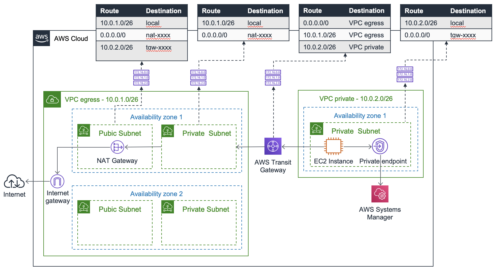

## Transit Gateway Demo Stack: Egress-VPC Design Pattern
> This CDK project demonstrates the shared Egress-VPC design pattern where one or multiple isolated VPCs can share / use a dedicated egress VPC with one or multiple shared NAT Gateways. 

## Set-up
The Stack will deploy:
- 1 x Transit Gateway
- 2 x VPCs (one private one with an Internet Gateway)
- 1 X EC2 instance in the private VPC, managed via Systems Manager
- Transit Gateway Attachments, Routes, Security Groups, private Interface and Gateway Endpoints for Systems Manger, etc.

## Solution Design

## Useful CDK commands
 * `npm run build`   compile typescript to js
 * `npm run watch`   watch for changes and compile
 * `cdk deploy`      deploy this stack to your default AWS account/region
 * `cdk diff`        compare deployed stack with current state
 * `cdk synth`       emits the synthesized CloudFormation template

## License

This library is licensed under the MIT-0 License. See the LICENSE file.

